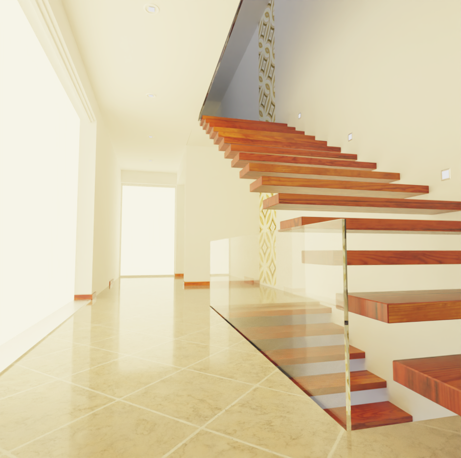
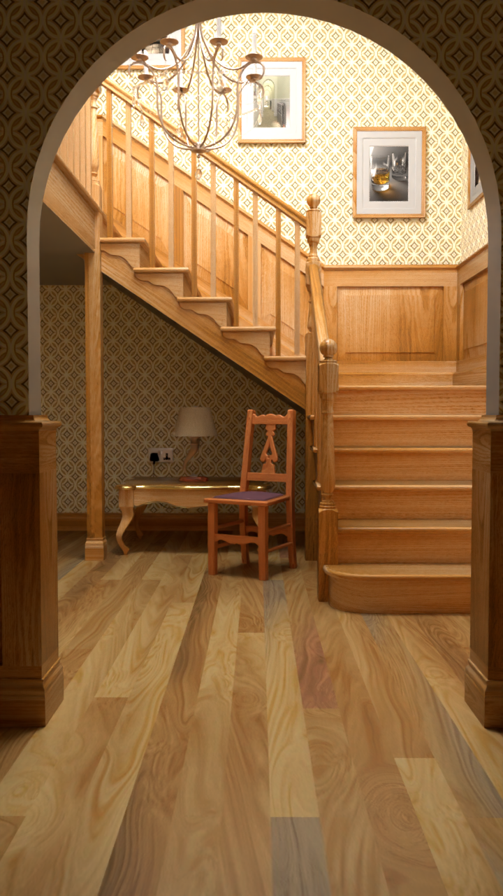
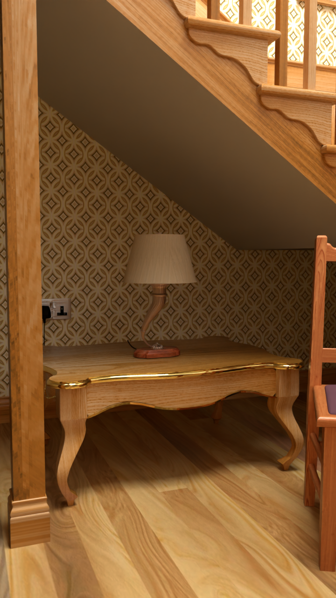
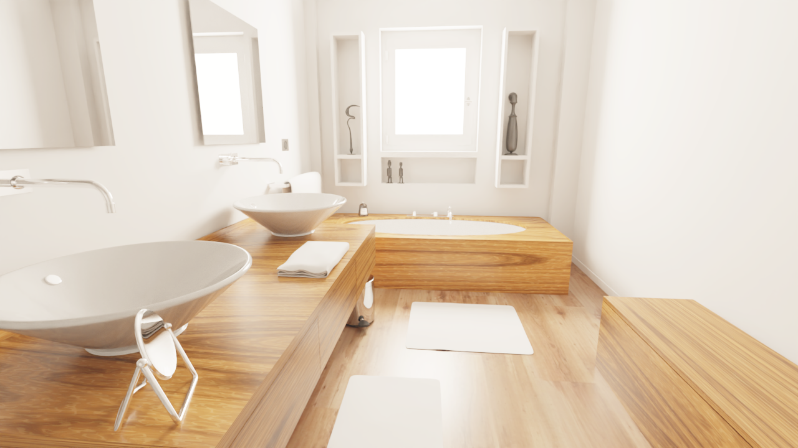
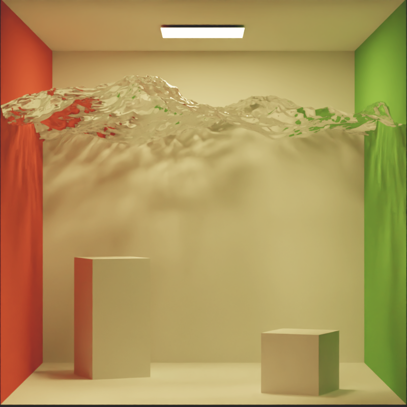
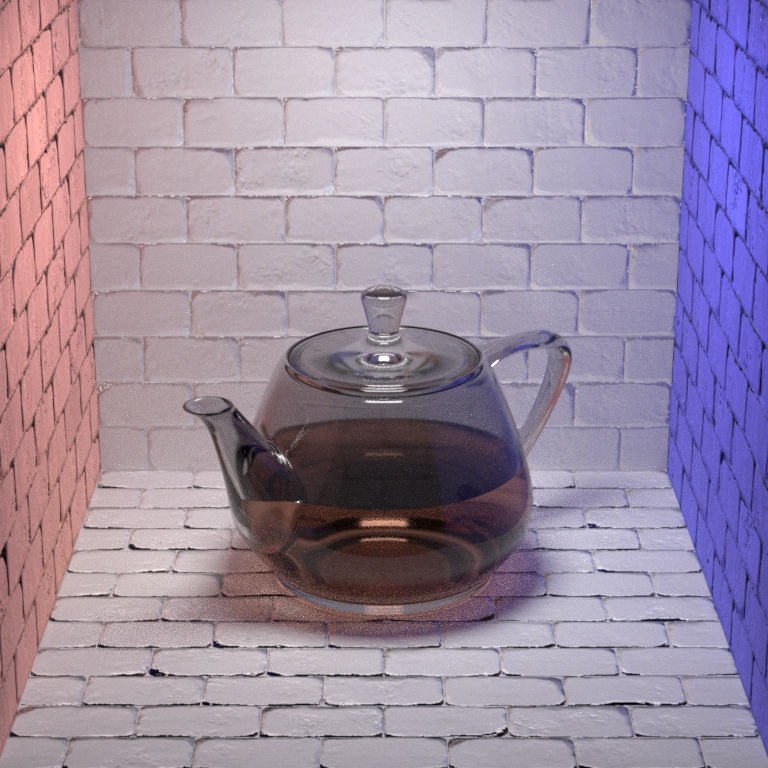
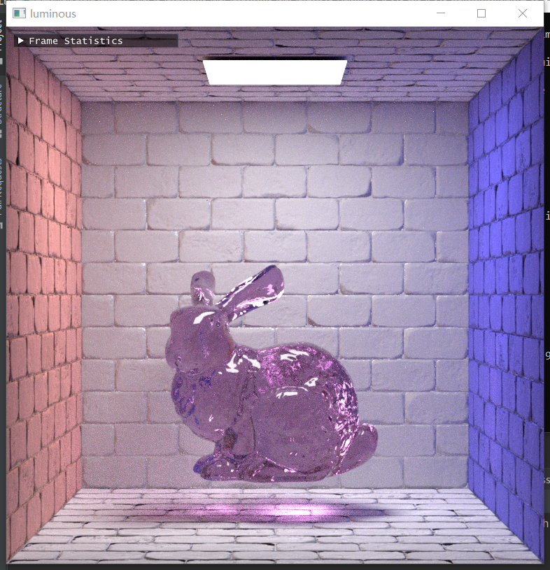
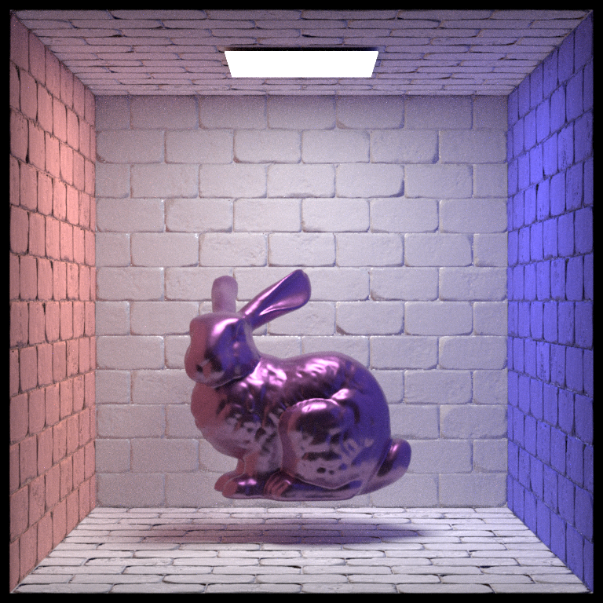
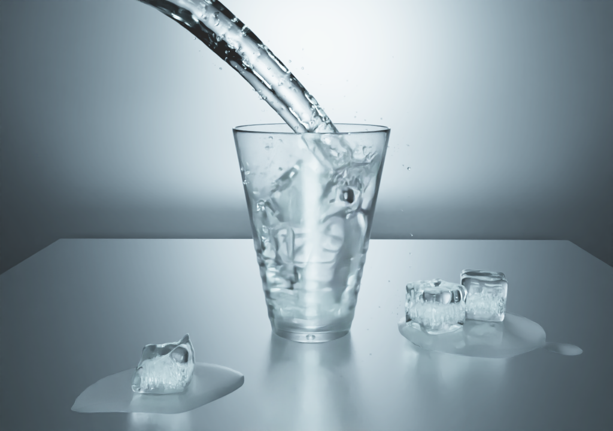

# LumiRender
A GPU/CPU physically based renderer

## platform
###windows 10

-DCMAKE_TOOLCHAIN_FILE=E:\work\tools\vcpkg\scripts\buildsystems\vcpkg.cmake

## Features

### Render algorithm
| Feature                                                 | Progress  |
|---------------------------------------------------------|-----------|
| Megakernel path tracing                                 | Done      |
| Normal visualize                                        | Done      |
| Wavefront path tracing                                  | Done      |
| Bidirectional path tracing                              | Planned   |
| Photon mapping                                          | Planned   |

### Reconstruction Filters
| Feature                      | Progress    |
|------------------------------|-------------|
| Filter Importance Sampling   | Done        |
| Mitchell-Netravali Filter    | Done        |
| Box Filter                   | Done        |
| Triangle Filter              | Done        |
| Gaussian Filter              | Done        |
| Lanczos Windowed Sinc Filter | Done        |

### Materials
| Feature                      | Progress    |
|------------------------------|-------------|
| metal                        | Done        |
| matte                        | Done        |
| glass                        | Done        |
| mirror                       | Done        |
| substrate                    | Done        |
| disney                       | Done        |
| hair                         | Planned     |
| BSSRDF                       | Planned     |

### Sensor
| Feature                                   | Progress    |
|-------------------------------------------|-------------|
| Thin-Lens Cameras                         | Done        |
| Realistic Cameras                         | Planned     |
| Fish-Eye Cameras                          | Planned     |
| Geometry surface(for light map baker)     | Planned     |

### Illumination
| Feature                                       | Progress    |
|-----------------------------------------------|-------------|
| Diffuse Area Lights, emission                 |  done       |
| HDRI Environment Maps                         |  done       |
| Uniform-Distribution Light Selection Strategy |  done       |
| Power-Distribution Light Selection Strategy   |  Planned    |
| BVH Light Selection Strategy                  |  Planned    |

### Backends
| Feature             | Progress                                            |
|---------------------|-----------------------------------------------------|
| GPU                 | Done (with CUDA + OptiX)                            |
| CPU                 | Done (with embree)                                  |

### Exporters
| Feature             | Progress                                            |
|---------------------|-----------------------------------------------------|
| Blender             | working                                             |
| 3DS Max             | Planned                                             |

Part of the scene comes from https://benedikt-bitterli.me/resources/

## Gallery
wavefront pt + independent sampling + pinhole camera on GPU

wavefront pt + independent sampling + thin lens camera on GPU

wavefront pt

Looks like something's wrong

